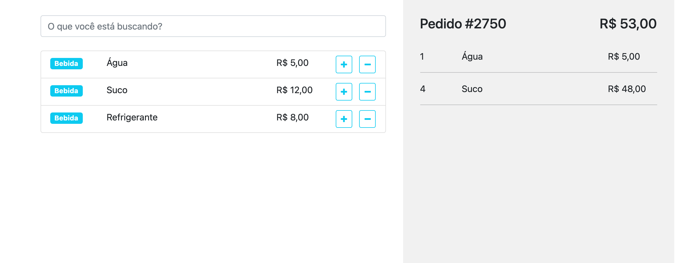

# VueJS Order List

<p align="center" >
    
</p>

# About The Project

The project is a simple `vuejs` and `nodejs` fullstack project.

The following technologies were used:

- [Vue.js](https://vuejs.org/)
- [Axios](https://axios-http.com/)
- [Node.js](https://nodejs.org/)
- [Apollo Server](https://www.apollographql.com/)
- [GraphQL](https://graphql.org/)

## Resources

- Get data with `GraphQL` from `NodeJS` application
- List `Items` in `VueJS` single component application
- Add and remove `Items` to a `Order List` in sidebar
- Search `Items`

## Run the Project

Clone this project:

```bash
git clone https://github.com/leomiranda/order-list-vue-node-graphql.git
cd order-list-vue-node-graphql
```

Run `server` (nodejs):

```bash
cd server
npm i
node server
```

Now your server is running on [`localhost:4000`](http://localhost:4000).

Run `client` (vuejs):

```bash
cd client
npm i
npm run serve
```

Now your server is running on [`localhost:8080`](http://localhost:8080).
